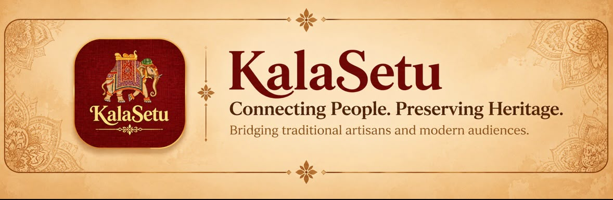

  

Connecting People with Traditional Artisans. Preserving India’s Cultural Heritage.

KalaSetu is a platform designed to connect people with traditional artisans and help preserve India’s rich regional art, craft, and cultural heritage.

Our aim is to bridge the gap between traditional artisans and modern audiences by making regional craftsmanship more accessible and discoverable.

## 🌟 The Problem

Traditional artisans and regional crafts often struggle with visibility, accessibility, and opportunities to reach wider audiences.

As a result, many traditional art forms and cultural practices risk being forgotten over time.

## 💡 Our Solution

KalaSetu provides a digital platform that brings traditional artisans, their crafts, and cultural stories closer to people.

Through technology, we aim to create opportunities for artisans while helping people discover and appreciate India’s diverse heritage.

## ✨ Key Features

<table>
  <tr>
    <td width="50%">
      
      <h3>Artisan Discovery</h3>
      Discover traditional artists and their work.
    </td>
    <td width="50%">
      
      <h3>Cultural Preservation</h3>
      Document and showcase regional art forms.
    </td>
  </tr>
  <tr>
    <td width="50%">
      
      <h3>Craft Stories</h3>
      Explore the stories behind traditional crafts.
    </td>
    <td width="50%">
      
      <h3>Digital Accessibility</h3>
      Make traditional crafts easier to discover.
    </td>
  </tr>
</table>

## 🌐 Live Project

Website: 

GitHub Repository: 

## 🛠️ Technology Stack

•⁠  ⁠Frontend: 

•⁠  ⁠Backend: 

•⁠  ⁠Programming Languages: 

•⁠  ⁠Database: 

•⁠  ⁠AI / ML: 

•⁠  ⁠APIs and Integrations: 

##

Built with ❤️ for India’s traditional artisans and cultural heritage.
