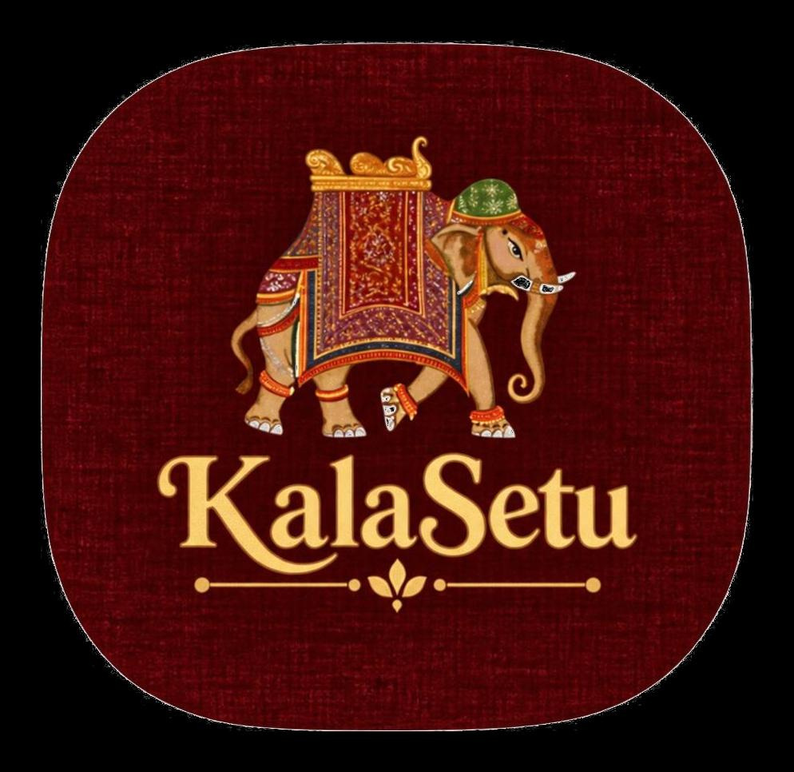

<table width="100%" cellpadding="25" cellspacing="0" bgcolor="#2B1917">
  <tr>
    <td width="28%" align="center" valign="middle">
      
    </td>
    <td width="72%" valign="middle">
      <h1>
        KalaSetu
      </h1>
      <h2>
        Connecting People. 
          Preserving Heritage.
        
      </h2>
      

        
          Bridging traditional artisans and modern audiences.
        
      

    </td>
  </tr>
</table>
Connecting People with Traditional Artisans. Preserving India’s Cultural Heritage.

KalaSetu is a platform designed to connect people with traditional artisans and help preserve India’s rich regional art, craft, and cultural heritage.

Our aim is to bridge the gap between traditional artisans and modern audiences by making regional craftsmanship more accessible and discoverable.

## 🌟 The Problem

Traditional artisans and regional crafts often struggle with visibility, accessibility, and opportunities to reach wider audiences.

As a result, many traditional art forms and cultural practices risk being forgotten over time.

## 💡 Our Solution

KalaSetu provides a digital platform that brings traditional artisans, their crafts, and cultural stories closer to people.

Through technology, we aim to create opportunities for artisans while helping people discover and appreciate India’s diverse heritage.

## ✨ Key Features

•⁠  ⁠Artisan Discovery: Explore traditional artisans and their craftsmanship.
•⁠  ⁠Cultural Preservation: Help document and showcase regional art forms.
•⁠  ⁠Digital Accessibility: Make traditional crafts accessible to a wider audience.
•⁠  ⁠Technology Integration: Use digital tools to improve accessibility and user experience.

## 🌐 Live Project

Website: 

GitHub Repository: 

## 🛠️ Technology Stack

•⁠  ⁠Frontend: 

•⁠  ⁠Backend: 

•⁠  ⁠Programming Languages: 

•⁠  ⁠Database: 

•⁠  ⁠AI / ML: 

•⁠  ⁠APIs and Integrations: 

## 🚀 Getting Started

To explore or run the project locally:

1.⁠ ⁠Clone the repository.

git clone [YOUR REPOSITORY URL]

2.⁠ ⁠Navigate to the project directory.

cd kalasetu

3.⁠ ⁠Follow the setup instructions provided in the respective app and website folders.

## 🎯 Our Vision

To create a digital bridge between India’s traditional artisans and the modern world, ensuring that regional craftsmanship, stories, and cultural heritage continue to be discovered and appreciated by future generations.

##

Built with ❤️ for India’s traditional artisans and cultural heritage.
